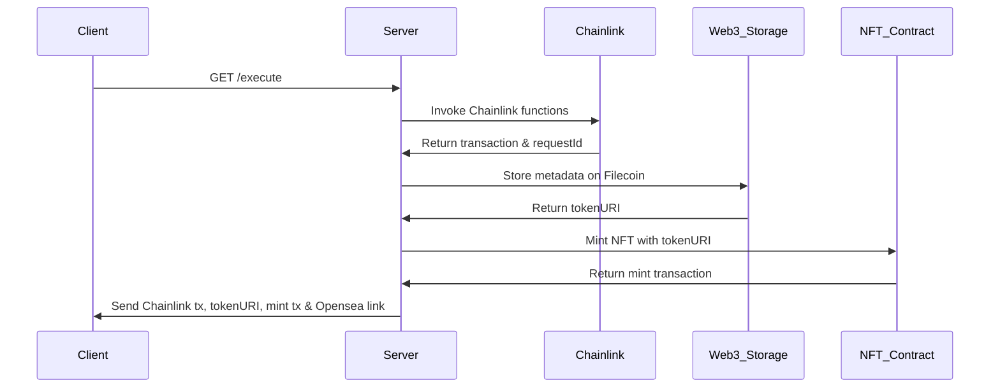

# NoFakeChain

submitted track
- Chainlink Functions
- FileCoin(WEB3Storage)
- Polygon


# API-Server
## Install
guide to run api server in local

```
cd deepfake_platform/api_server 
npm install
npm run start
```
## Overview
This API-Server provides an interface to invoke Chainlink functions, store metadata on Filecoin (via Web3.Storage), mint NFTs, and handle image uploads with a determination of whether they're deepfakes or not. Additionally, it interacts with a MongoDB database for data insertion operations.

## Prerequisites
Set up Node.js and npm.
```
Install required npm packages and relevant software:
express
ethers
mongodb
@chainlink/functions-toolkit
dotenv
web3-storage
```

## A. GET /execute
This endpoint performs several operations:
1. Invokes Chainlink functions.
2. Stores metadata on Filecoin through Web3.Storage.
3. Mints an NFT with a provided address and token URI.

### Sequence Diagram


### Request:
No request parameters are needed for this endpoint.
### Response:
A string displaying the Chainlink transaction, the decoded Chainlink response (commented out in the given code), the token URI on Filecoin, the mint transaction for the NFT, and a link to view the minted NFT on Opensea (Mumbai Testnet).
### Example:
```
GET /execute
```

## B. POST /api/upload
This endpoint allows a user to upload an image. It determines if the image is a deepfake and stores this information, alongside the image's CID from Filecoin, in a MongoDB database.

### Request Parameters:
image: The image file to be uploaded.
### Response:
Returns the cid of the uploaded image on Filecoin.
### Example:
Using a tool like curl, the request could look like:
```
curl -X POST -F "image=@path_to_image.jpg" http://your_api_url/api/upload
```
## .env format
```
RPC_URL_MATIC=https://polygon-mumbai.infura.io/v3/
PRIVATE_KEY=
MUMBAI_SCAN=
POLYGON_MUMBAI_RPC_URL=https://polygon-mumbai.infura.io/v3/
PUBLIC_KEY=
WEB3STORAGE_TOKEN=
```
We need WEB3STORAGE_TOKEN for IPFS upload on FileCoin

homepage : https://web3.storage/
module : https://www.npmjs.com/package/web3.storage

# Contract

## Install
```
cd contracts
npm install
npm run start
```

## Scripts
- deployChainlink : deploy FunctionsConsumer contract for Chainlink Functions
- deployNFT : deply ERC721 NFT
- getTokenURI : getTokenURI of NFT

## Deployed Contracts
- ERC721 contract (ERC721, ERC721URIStorage, ERC721Pausable, Ownable, ERC721Burnable)
- FunctionsConsumer contract (Consumer Contract for chainlink functions)

## .env format

```
PRIVATE_KEY=
TEST_PRIVATE_KEY=
MUMBAI_SCAN=
POLYGON_MUMBAI_RPC_URL=https://polygon-mumbai.infura.io/v3/
RPC_URL_MATIC=https://polygon-mumbai.infura.io/v3/
```


